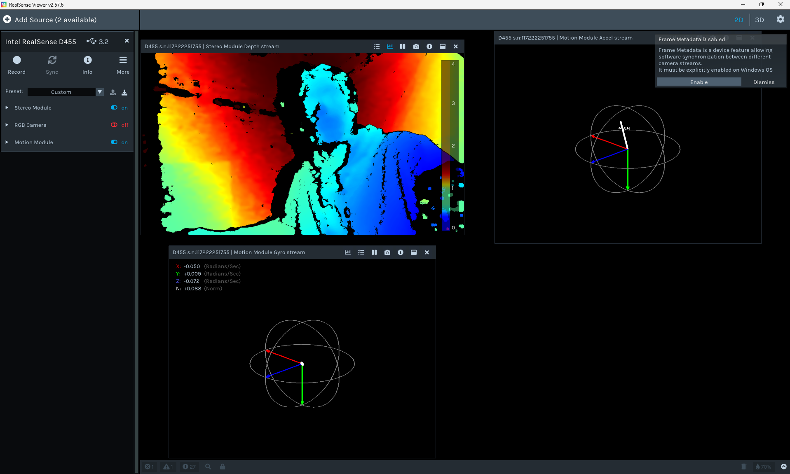

# Intel RealSense D455 — RGB Camera Calibration

Intrinsic calibration of the Intel RealSense D455 RGB color stream
using OpenCV's checkerboard method on Windows 10/11.

## Hardware Used
- Intel RealSense D455
- Printed 10x7 checkerboard, 26.5mm squares
- Mounted flat on rigid cardboard backing

---

## Calibration Results

| Metric | Value |
|---|---|
| Mean Reprojection Error | 0.0226 px |
| Max Reprojection Error | 0.0488 px |
| Valid Images | 50 / 50 |
| Resolution | 1280 x 720 |
| Grade | EXCELLENT |

### Camera Matrix (K)
| Parameter | Value |
|---|---|
| fx | 634.61 px |
| fy | 634.86 px |
| cx | 636.02 px |
| cy | 375.95 px |

Full output: [calibration_output/d455_calibration.yaml](calibration_output/d455_calibration.yaml)

---

## RealSense Viewer — SDK Verification

Before running the Python calibration pipeline, the camera was verified
using the Intel RealSense Viewer (v2.57.6). The depth, RGB, and IMU
modules were all confirmed working.

The image below shows the Motion Module live — both the accelerometer
and gyroscope streams are active and producing valid 6-DoF orientation
data, essential for SLAM and Nav2 integration.


---

## Setup

### 1. Install Intel RealSense SDK
Download the Windows installer from:
[https://github.com/realsenseai/librealsense/releases](https://github.com/realsenseai/librealsense/releases)

Download and run: `RealSense.SDK-WIN10-x.xx.x.exe`

### 2. Install Python dependencies
```bash
pip install -r requirements.txt
```

---

## Workflow

### Step 1 — Generate checkerboard
```bash
python generate_board.py
```
Saves `checkerboard_PRINT_ME.png`. Print at **100% scale, no fit-to-page**. Measure one square with a ruler, then mount flat on a rigid surface.

### Step 2 — Capture images
```bash
python capture.py
```
- `SPACE` — save current frame
- `Q` — quit when done
- Target: 40–50 images with varied angles, tilts, and distances
- Keep the full checkerboard visible in every shot

### Step 3 — Update square size
Open `calibrate.py` and update line 17 with your measured square size:
```python
SQUARE_SIZE_METERS = 0.0265  # example: 26.5mm
```

### Step 4 — Run calibration
```bash
python calibrate.py
```
Saves `camera_matrix.npy`, `dist_coeffs.npy`, and `d455_calibration.yaml` to `calibration_output/`

### Step 5 — Verify
```bash
python use.py
```
Displays raw vs undistorted feed side by side. Straight lines in the real world should look straight in the undistorted frame.

---

## Using the Calibration in ROS 2 / Nav2

Copy `calibration_output/d455_calibration.yaml` into your ROS 2 package and point your camera node to it:
```yaml
camera_info_url: "file:///absolute/path/to/calibration_output/d455_calibration.yaml"
```

---

## Requirements
See [requirements.txt](requirements.txt)
